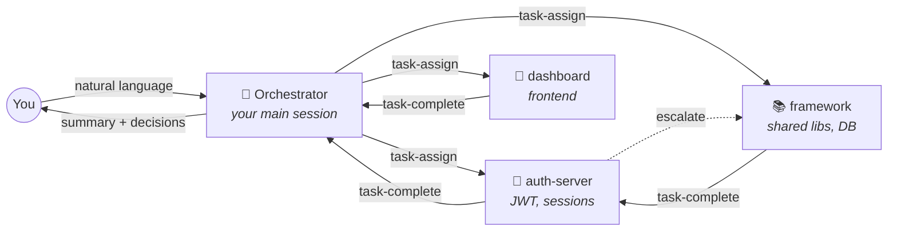
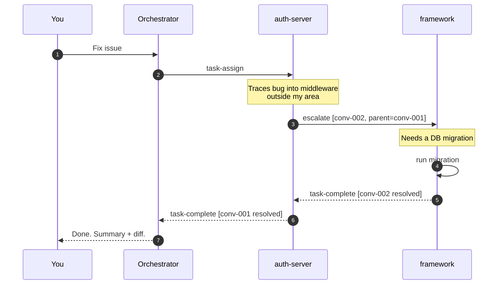
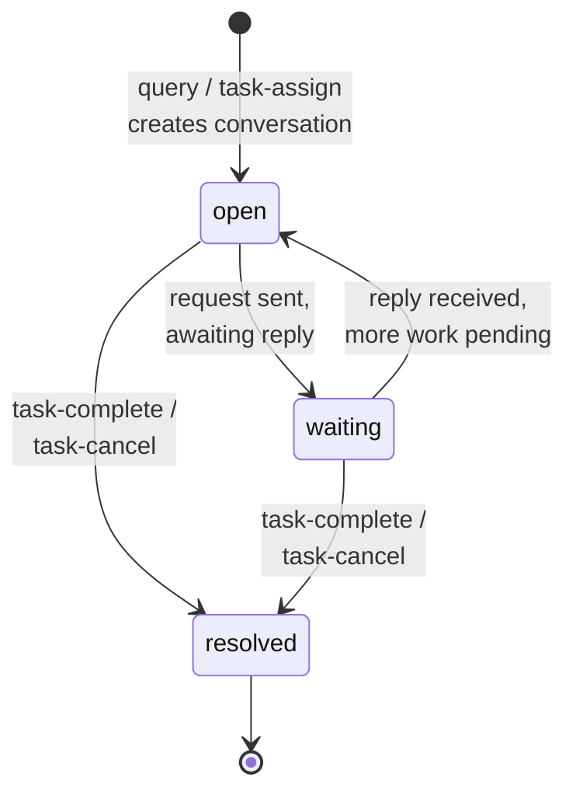

<p align="center">
  <h1 align="center">session-bridge</h1>
  <p align="center">
    <strong>Let your Claude Code sessions work together</strong>
  </p>
  <p align="center">
    <a href="LICENSE"></a>
    
    
  </p>
  <p align="center">
    <a href="#how-it-works">How It Works</a> &middot;
    <a href="#getting-started">Getting Started</a> &middot;
    <a href="#orchestration">Orchestration</a> &middot;
    <a href="#commands">Commands</a> &middot;
    <a href="#under-the-hood">Under the Hood</a> &middot;
    <a href="#developing-against-a-local-checkout">Local Dev</a>
  </p>
</p>

---

Working across multiple repos? Each Claude Code session is isolated — the auth server doesn't know what the frontend changed, the framework doesn't know the API contract shifted. **session-bridge** connects them so they coordinate autonomously.

You talk to one session. It delegates to the others, they collaborate, escalate when stuck, ask you for decisions they can't make, and report back when done. You don't switch terminals.



---

## How It Works

**session-bridge** is a Claude Code plugin. Sessions communicate through JSON messages on the local filesystem — no server, no network, no extra API cost. The agent that made the changes answers questions about them, with its full context.

**Key concepts:**

- **Projects** group sessions together. Sessions in "plextura-suite" are isolated from "website-redesign".
- **Roles** define behavior. The **orchestrator** assigns tasks and tracks progress. **Specialists** do the work.
- **Conversations** thread messages with state tracking. When a specialist escalates to another specialist, conversations chain together. Results flow back up.
- **Natural language** drives everything. You say "fix these issues" and the orchestrator routes work to the right specialist based on their registered specialty. No `/bridge` commands needed for day-to-day use.
- **Auto-join** means setup is one-time. After the first join, opening Claude in that directory automatically reconnects to the project.

---

## Getting Started

### Install

```bash
# Dependencies
brew install jq                    # macOS
sudo apt install jq inotify-tools  # Linux (inotify-tools recommended for instant message delivery)

# Clone
git clone https://github.com/DiAhman/claude-code-session-bridge.git ~/claude-code-session-bridge
```

**Load the plugin** (choose one):

```bash
# Option A: Per-session
claude --plugin-dir ~/claude-code-session-bridge/plugins/session-bridge

# Option B: Permanent (add to ~/.claude/settings.json)
```
```json
{
  "extraKnownMarketplaces": {
    "session-bridge": {
      "source": {
        "source": "directory",
        "path": "~/claude-code-session-bridge"
      }
    }
  },
  "enabledPlugins": {
    "session-bridge@session-bridge": true
  }
}
```

### One-Time Setup

Open a terminal for each component of your project. Run the setup commands once — they're remembered forever after.

**Terminal 1** — your orchestrator (the session you'll talk to):
```
cd ~/projects/my-app && claude

> /bridge project create my-suite
> /bridge project join my-suite --role orchestrator --specialty "task coordination"
```

**Terminal 2** — a specialist:
```
cd ~/projects/auth-server && claude

> /bridge project join my-suite --role specialist --specialty "authentication, JWT, sessions"
> /bridge standby
```

**Terminal 3** — another specialist:
```
cd ~/projects/shared-framework && claude

> /bridge project join my-suite --role specialist --specialty "shared libraries, database, utilities"
> /bridge standby
```

That's it for setup. **You never need to do this again.** Each session's role, specialty, and project are saved to `.claude/bridge-role` in its directory.

### Every Time After

Just open Claude in each directory. The plugin auto-joins on startup:

```bash
# Terminal 1
cd ~/projects/my-app && claude
# -> "Auto-joined project 'my-suite' as orchestrator"

# Terminal 2
cd ~/projects/auth-server && claude
# -> "Auto-joined project 'my-suite' as specialist (authentication, JWT, sessions)"
# > /bridge standby

# Terminal 3
cd ~/projects/shared-framework && claude
# -> "Auto-joined project 'my-suite' as specialist (shared libraries, database, utilities)"
# > /bridge standby
```

The only manual step is `/bridge standby` for specialists — this puts them into the listen loop so they're ready to receive work. The orchestrator doesn't need standby; you talk to it directly.

### Use It

Back in Terminal 1, just talk naturally:

```
> Here are today's issues: #123 (token expiry bug), #124 (database migration),
  #125 (new user dashboard). Assign them to the right sessions.
```

The orchestrator matches issues to specialists by specialty, sends task assignments, and tracks progress. Specialists wake up, do the work, and report back. You can walk away.

---

## Orchestration

### Task Delegation Chains

When a specialist hits a problem outside its area, it escalates automatically. Each handoff creates a **conversation** with a `parentConversation` link; when child conversations resolve, results cascade back up the chain.



### Human-in-the-Loop

Agents don't guess on decisions that need your judgment. They escalate:

```
> /bridge decisions

2 decisions need your input:

1. [auth-server] JWT expiry: 15min vs 1hr tokens?
   Recommendation: 15min (security best practice)
   Status: BLOCKED — waiting on you

2. [framework] Add connection pooling to the database layer?
   Recommendation: yes, pool size 10
   Status: continued with default (will adjust if you disagree)
```

- **Non-blocking**: agent continues with its proposed default. Override later if needed.
- **Blocking**: agent waits in standby until you answer.

The orchestrator collects decisions from all specialists and surfaces them when you interact.

### Peer Routing

Sessions find the right peer automatically:

1. **Topology hints** — `project.json` can define explicit routes
2. **Specialty matching** — scan peer manifests, match problem domain against `specialty`
3. **Orchestrator query** — ask "who handles database migrations?" and get directed

---

## Commands

### Project Management

| Command | Description |
|---------|-------------|
| `/bridge project create <name>` | Create a new multi-session project |
| `/bridge project join <name>` | Join a project (`--role`, `--specialty`, `--name` flags) |
| `/bridge project list` | List all projects on this machine |

### Session Operations

| Command | Description |
|---------|-------------|
| `/bridge peers` | List sessions with roles, specialties, and status |
| `/bridge status` | Show conversations, pending decisions, message counts |
| `/bridge standby` | Enter standby loop (handle messages continuously) |
| `/bridge decisions` | Show pending decisions that need your input |
| `/bridge stop` | Disconnect, notify peers, clean up |

> **You rarely need these.** After setup, just talk to your orchestrator in natural language. The bridge-awareness skill handles routing, messaging, and coordination automatically.

---

## Ad-Hoc Mode

Don't need full orchestration? The original two-session bridge still works:

```
Terminal 1: /bridge start            -> Session ID: a1b2c3
Terminal 2: /bridge connect a1b2c3   -> Connected to 'my-library'
Terminal 1: /bridge standby          -> Standing by...
Terminal 2: "Ask the library what breaking changes it made"
```

No project, no roles, no setup. Good for quick one-off questions between two sessions.

Legacy commands: `/bridge start`, `/bridge connect <id>`, `/bridge ask <question>`, `/bridge listen`.

---

## Under the Hood

### Communication

Three complementary delivery paths, each optimized for a different session state:

```mermaid
flowchart TD
    subgraph idle[Session idle]
        LS[bridge-listen.sh]
        LS -->|inotifywait blocks<br/>zero CPU| W{Message<br/>arrives?}
        W -->|yes| Deliver1[Deliver + exit]
    end
    subgraph active[Actively tool-using]
        TU[Tool call] --> PTU[PostToolUse hook]
        PTU -->|rate-limited 5s| Check1[check-inbox.sh]
        Check1 -->|pending?| Inject1[Inject into context]
    end
    subgraph turn[Turn boundary]
        End[Turn ends] --> Stop[Stop hook]
        Stop --> Check2[check-inbox.sh --stop-hook]
        Check2 -->|pending?| Block[Block stop, inject batch]
        Block --> Handle[Agent processes batch]
        Handle --> End
    end
```



- **At turn boundaries**: `Stop` hook drains the queue when Claude finishes responding. Multiple messages in a burst get handled without relaunching the listener. Safety cap at 10 consecutive blocks.
- **During active work**: `PostToolUse` hook checks inbox every 5 seconds (rate-limited). `UserPromptSubmit` checks immediately when you press Enter.
- **During idle**: `bridge-listen.sh` blocks on `inotifywait` (Linux) or `fswatch` (macOS) — zero CPU, instant wakeup.
- **Status markers**: listener output is prefixed with `BRIDGE_STATUS=delivered` / `already_running` / `timeout` so the agent never double-launches or burns cycles misinterpreting silent exits.
- **Visibility lines**: after handling each message the agent emits a compact two-line trace (`← task-update from web (abc123): migration done, moving to UI` then `→ standby`) so the transcript stays readable even during bursts.
- **Messages**: JSON files in each session's inbox directory. Atomic writes (temp file + `mv`). Protocol version 2.0.

### Conversations

Auto-created on `query` and `task-assign`, auto-resolved on `task-complete`. Threaded via `conversationId`, chained via `parentConversation`.



### Message Types

| Type | Purpose |
|------|---------|
| `task-assign` | Delegate work (creates a new conversation) |
| `query` / `response` | Ask and answer (query creates a conversation if none) |
| `escalate` | Route work to another specialist (creates child conversation) |
| `task-complete` | Report finished work (auto-resolves conversation) |
| `task-update` | Progress report mid-task |
| `task-cancel` / `task-redirect` | Cancel or replace an in-flight task |
| `human-input-needed` / `human-response` | Decision escalation to and from the user |
| `routing-query` | "Who handles X?" — usually answered by the orchestrator |
| `ping` | Connection check |
| `session-ended` | Peer is shutting down — sent automatically on `/bridge stop` |

### Directory Structure

```
~/.claude/session-bridge/
  projects/
    my-suite/
      project.json                # Metadata + topology routing
      conversations/              # Conversation state
      sessions/
        abc123/                   # One session
          manifest.json           # Role, specialty, heartbeat
          inbox/                  # Incoming messages
          outbox/                 # Sent messages
  sessions/                       # Legacy ad-hoc sessions
```

### Auto-Join

On first `/bridge project join`, the plugin saves your config to `.claude/bridge-role` in your project directory:

```json
{
  "role": "specialist",
  "specialty": "authentication, JWT, sessions",
  "name": "auth-server",
  "project": "my-suite"
}
```

A `SessionStart` hook reads this file and auto-joins on every subsequent `claude` launch. The agent sees a confirmation message with project, role, and online peer count.

---

## Platform Support

| Platform | Status | Notes |
|----------|--------|-------|
| Linux | Tested | `inotifywait` for zero-CPU standby |
| macOS | Supported | `fswatch` alternative, BSD `date` fallback |
| Windows | Not supported | |

**Prerequisites**: `jq` (required), `inotify-tools` or `fswatch` (recommended, falls back to polling).

## Running Tests

```bash
cd plugins/session-bridge && bash test.sh
# 353 passed, 0 failed (22 test files)
```

## Developing Against a Local Checkout

If you're editing this plugin and your changes don't seem to take effect: Claude Code **snapshots** directory-source plugins at install time into `~/.claude/plugins/cache/session-bridge/session-bridge/<version>/`. Edits to the source don't propagate until you reinstall the plugin via `/plugin`, or replace the snapshot with a symlink:

```bash
# one-time setup for live development
rm -rf ~/.claude/plugins/cache/session-bridge/session-bridge/<old-version>
ln -s /path/to/claude-code-session-bridge/plugins/session-bridge \
      ~/.claude/plugins/cache/session-bridge/session-bridge/live

# then update ~/.claude/plugins/installed_plugins.json so
# session-bridge's installPath points at .../live
```

After that, every edit is picked up on the next Claude Code restart — no reinstall dance.

<details>
<summary>Plugin file structure</summary>

```
plugins/session-bridge/
  .claude-plugin/plugin.json
  commands/bridge.md
  hooks/hooks.json
  skills/bridge-awareness/SKILL.md
  scripts/
    auto-join.sh                   project-create.sh
    project-join.sh                project-list.sh
    project-update-member.sh       conversation-create.sh
    conversation-update.sh         inbox-watcher.sh
    send-message.sh                check-inbox.sh
    bridge-listen.sh               bridge-receive.sh
    list-peers.sh                  cleanup.sh
    get-session-id.sh              heartbeat.sh
    register.sh                    connect-peer.sh
  test.sh
  tests/ (22 test files, 353 tests)
```

</details>

## Design Documents

- **v2 spec** — [`docs/superpowers/specs/2026-03-19-bidirectional-bridge-design.md`](docs/superpowers/specs/2026-03-19-bidirectional-bridge-design.md)
- **v2 plan** — [`docs/superpowers/plans/2026-03-19-bidirectional-bridge.md`](docs/superpowers/plans/2026-03-19-bidirectional-bridge.md)
- **Departments brainstorm** — [`docs/superpowers/specs/2026-04-22-departments-hierarchy-brainstorm.md`](docs/superpowers/specs/2026-04-22-departments-hierarchy-brainstorm.md) (3-layer hierarchy exploration, not yet implemented)

## Credits

Fork of [PatilShreyas/claude-code-session-bridge](https://github.com/PatilShreyas/claude-code-session-bridge) — the original peer-to-peer bridge concept. v2 adds bidirectional orchestration, project scoping, conversations, auto-join, and human-in-the-loop.

## License

[MIT](LICENSE)
